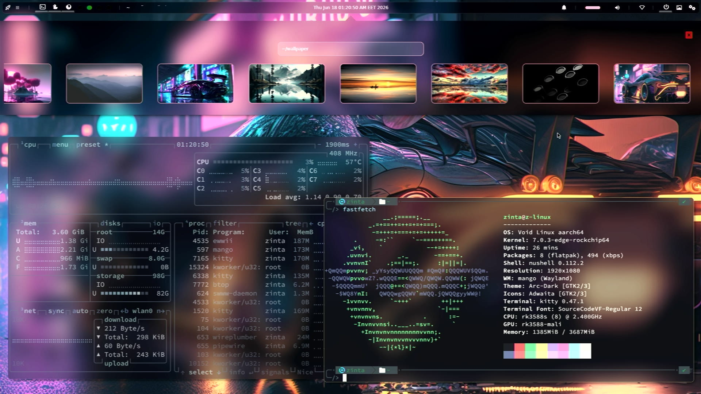
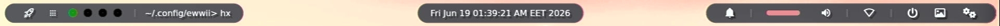
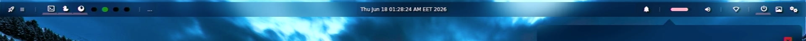
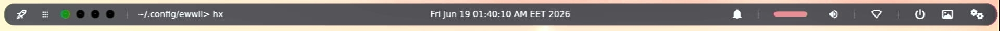
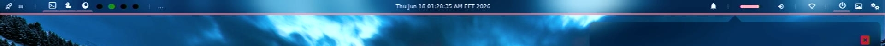
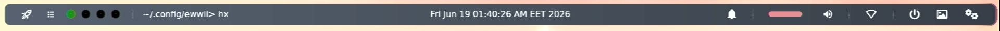
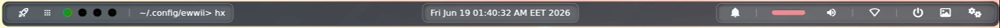
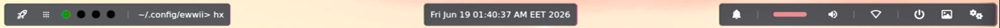

<p align="center">
  
</p>

<h1 align="center">dot-ewwii</h1>

<p align="center">
  A customizable EWWII status bar with multiple bar styles, color schemes, and an integrated settings panel.
</p>

<p align="center">
  <a href="#features">Features</a> •
  <a href="#dependencies">Dependencies</a> •
  <a href="#installation">Installation</a> •
  <a href="#usage">Usage</a> •
  <a href="#configuration">Configuration</a> •
  <a href="#color-schemes">Color Schemes</a> •
  <a href="#bar-styles">Bar Styles</a> •
  <a href="#keybindings">Keybindings</a> •
  <a href="#credits">Credits</a>
</p>

---

## Features

- **bar styles** — From rounded cards to gradient bars, pick the look that fits your desktop
- **color schemes** — Catppuccin Mocha, Dracula, Gruvbox, Nord, Tokyo Night, One Dark, Gotham, and Wallust
- **icon styles** — Different hover effects and border treatments for bar icons
- **Built-in settings panel** — Change bar style, color scheme, icon style, font size, and transparency on the fly
- **Font scaling** — Adjust font size from 0x to 2x via the settings GUI
- **Bar & window transparency** — Independently control bar and popup window opacity
- **Multi-compositor support** — Works with Sway, Hyprland, Niri, and Marco
- **Power menu** — Lock, logout, suspend, reboot, and poweroff in a clean overlay
- **Notification center toggle** — Quick access to your notification panel
- **Volume control** — Built-in slider with mute toggle (supports pamixer, wpctl, pactl, amixer)
- **Wallpaper browser** — Browse and set wallpapers from `~/wallpaper`
- **Application launcher** — One-click access to your configured launcher (fuzzel, rofi, etc.)
- **Workspace indicators** — Visual workspace dots (1–5) with active window highlighting

## Dependencies

| Dependency | Purpose |
|---|---|
| [EWWII](https://github.com/Ewwii-sh/ewwii.git) (>= 0.9.0) | Window manager widgets |
| [Nerd Fonts](https://www.nerdfonts.com/) | Icon glyphs |
| pamixer | Volume control |
| swww / swaybg / feh | Wallpaper backend |
| swaync-client / mako | Notification center |
| fuzzel / rofi / wofi | Application launcher |
| jq, bash, sed, grep | Scripting |

*Most of these are optional depending on which features you use.*

## Installation

Clone the repository:

```bash
git clone --depth 1 https://github.com/alzintali/dot-ewwii.git
```
Copy ewwii directory to $XDG_CONFIG_HOME path:

```bash
cp -r ./dot-ewwii/ewwii ~/.config/
```

That's it — no build step, no package manager required.

## Usage

Start the EWWII daemon and open the bar:

```bash
ewwii daemon
ewwii open bar
```

You can also add these commands to your WM startup script (e.g., `~/.config/hyprland/hyprland.conf` or Sway's `config`).

## Configuration

### Main Config

Edit `ewwii/nbcl/config.nbcl` to set your preferred launcher, wallpaper directory, notification center, and lock screen commands:

```scss
let config = {
  menu = "fuzzel --show"
  wallpaper_path = "~/wallpaper"
  bar_style = "style1"
  icons_style = "style1"
  setwallpaper_cmd = "swww img --transition-type any"
  notifi_center_cmd = "swaync-client -t"
  lockscreen_cmd = "swaylock"
  logout_cmd = ""
  suspend_cmd = "loginctl suspend"
  reboot_cmd = "loginctl reboot"
  poweroff_cmd = "loginctl poweroff"
}
```

### Variables

The file `ewwii/scss/variables.scss` controls the imported color scheme and transparency levels:

```scss
@import "color-schemes/catppuccin-mocha.scss";
$bar-transparency: 0.8;
$window-transparency: 0.8;
$font-scale: 1;
```

## Color Schemes

| Scheme | File |
|---|---|
| Catppuccin Mocha | `catppuccin-mocha.scss` |
| Dracula | `dracula.scss` |
| Gotham | `gotham.scss` |
| Gruvbox | `gruvbox.scss` |
| Nord | `nord.scss` |
| One Dark | `one-dark.scss` |
| Tokyo Night | `tokyo-night.scss` |
| Wallust (dynamic) | `wallust.scss` |

Change scheme on the fly via the settings panel, or manually update the `@import` in `variables.scss`.

You can create your own scheme by copying and adapting `scss/color-schemes/template.scss`.

## Bar Styles

| Preview | Style | Description |
|---|---|---|
|  | **style1** | Rounded sections with border and shadow |
|  | **style2** | Diamond-shaped separators with diagonal gradients |
|  | **style3** | Full-width background bar with padding |
|  | **style4** | Rounded full bar with border *(default)* |
|  | **style5** | Bottom-border accent bar |
|  | **style6** | Horizontal gradient bar |
|  | **style7** | Inset shadow with inner border |
|  | **style8** | Bordered start container with inset shadow |

Set via the settings panel or by changing `bar_style` in `config.nbcl`.

## Keybindings

These are not hardcoded — configure them in your window manager. Example for Hyprland:

```conf
# Open the bar (startup)
exec-once = ewwii daemon
exec-once = ewwii open bar
```

## Credits

- [EWWII](https://github.com/Ewwii-sh/ewwii) — The widget system that makes this possible
- Color scheme creators: [Catppuccin](https://github.com/catppuccin), [Dracula](https://draculatheme.com/), [Nord](https://www.nordtheme.com/), [Gruvbox](https://github.com/morhetz/gruvbox), [Tokyo Night](https://github.com/enkia/tokyo-night-vscode-theme), and [One Dark](https://github.com/atom/atom)

## License

[MIT](LICENSE)
